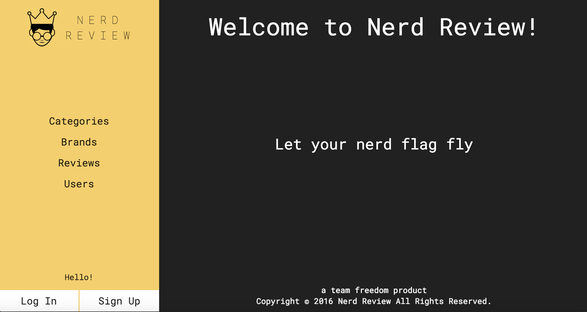
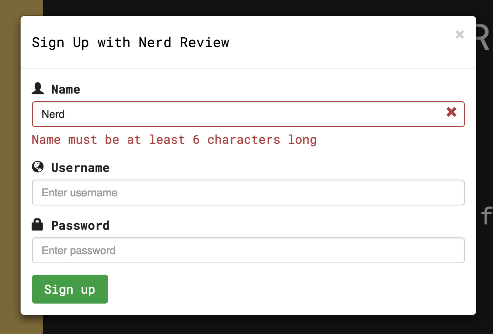
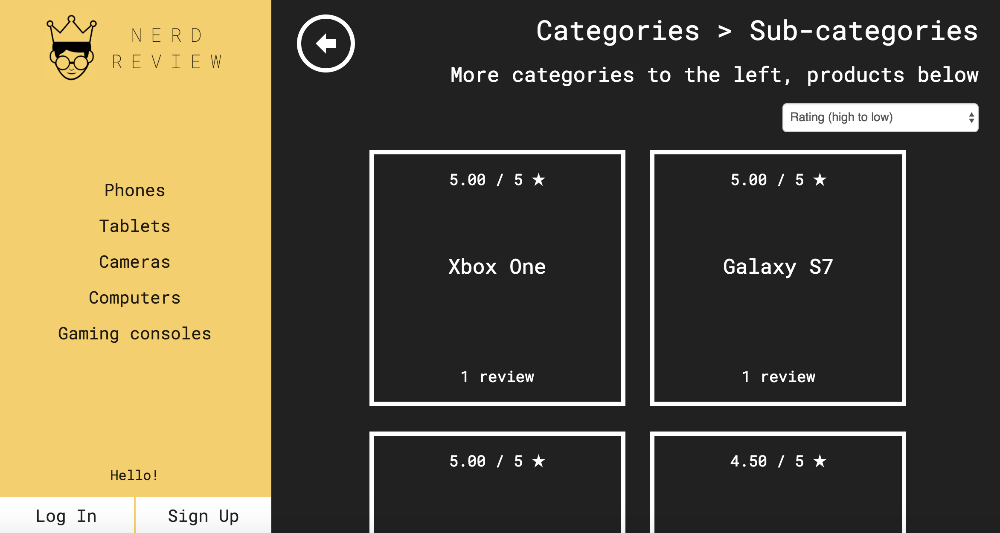
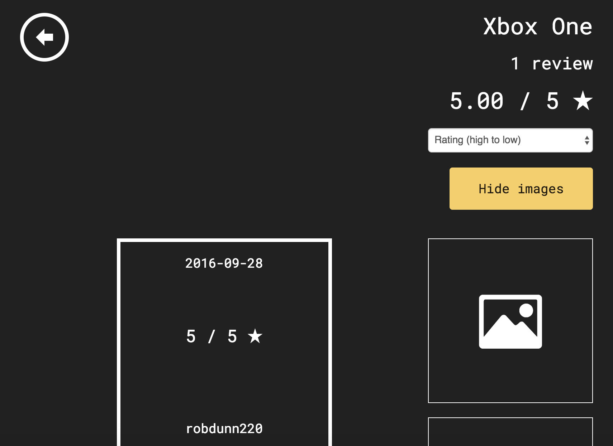
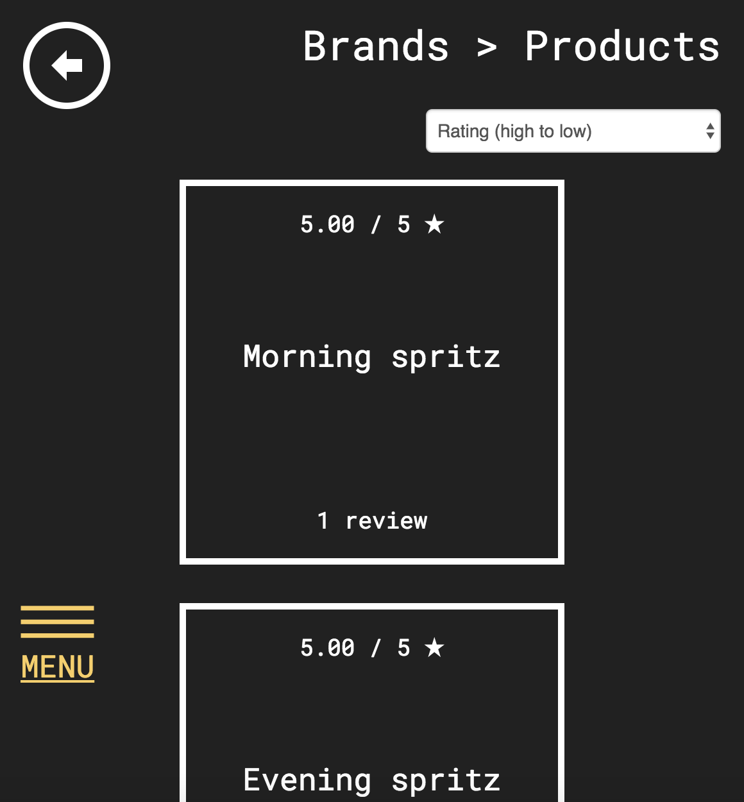
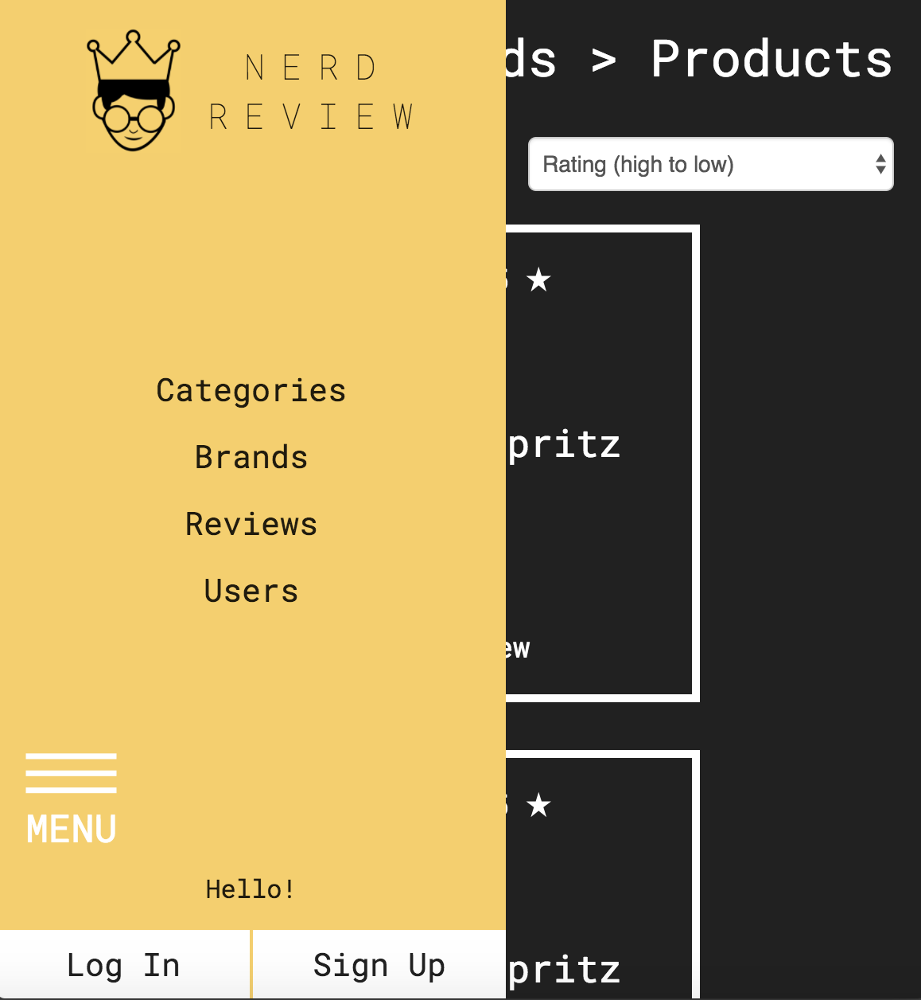

#Nerd Review

######
[Live Project](https://nerdreview.co)   |  [Overview](https://github.com/DigitalCrafts-September-2016-Cohort/team_freedom_nerdreview#overview)   |   [Team](https://github.com/DigitalCrafts-September-2016-Cohort/team_freedom_nerdreview#team-members--roles)   |   [What We Used](https://github.com/DigitalCrafts-September-2016-Cohort/team_freedom_nerdreview#what-we-used)   |   [MVP](https://github.com/DigitalCrafts-September-2016-Cohort/team_freedom_nerdreview#mvp-minimum-viable-product)   |   [Challenges](https://github.com/DigitalCrafts-September-2016-Cohort/team_freedom_nerdreview#code-snippets)   |   [Screenshots](https://github.com/DigitalCrafts-September-2016-Cohort/team_freedom_nerdreview#screenshots)   |   [Contributing](https://github.com/DigitalCrafts-September-2016-Cohort/team_freedom_nerdreview#contribute-to-nerd-review)

##Overview:
Nerd Review is a centralized platform that brings together product lovers of the obsessive and methodical variety from their respective corners of the internet.  The audience of the dedicated product review bloggers out there can often be limited to existing members of that community.  If you are a nerdy consumer branching into a new area or just researching every major purchase like a PhD thesis, your progress can be slowed by the fact that if you aren't already aware of that particular niche product review blog.  If you don't already know about it, you can't find it.  This web app provides a functioning framework for such a dedicated review site that bridges the gap between professional product reviewers and average consumers.  

**Our conceptual goals for the site:**
* Eliminate any commerce connection to keep site content impartial
* Reviewers are responsible for site content (user-generated content only, no listicles or subjective rankings)
* Primary content (reviews) should meet a minimum threshold of nerdiness
    - Minimum length
* Only registered users of Nerd Review can post reviews
* Reviews are associated with a product which is associated with a company, new products can be added directly by reviewers

##Github Link:
[NerdReview](https://github.com/DigitalCrafts-September-2016-Cohort/team_freedom_nerdreview.git)

##Team Members & Roles:
**Click on each member's name to see their GitHub profile**
All team members are students in the [Digital Crafts](https://digitalcrafts.com) September 2016 cohort. This project was initially completed as the first full-stack project for that curriculum and utilized the Scrum development process and philosophy.  Paired and mob programming were the focus in the initial and final stages, while mid and late stage work was primarily completed through individual but coordinated and co-located programming.

####Team Freedom
* [Che Blankenship](https://github.com/cheblankenship/)  
**Primary team role:** UI/UX evaluation, Quality control  
**Contributions:**  Regularly studied all code throughout project, particularly SQL queries on the backend (server.py) for redundancies or erroneous returns.  Investigated and fleshed out a possible solution for filtered drop-down select elements on the 'add a review page'.  Led team in continuously evaluating user-interface and user-experience of site, including semantics and critique of supported functionalities.
**Key code portions:** Co-wrote user login, sign up, and early iterations of the 'add a review form'.

* [John Coppola](https://github.com/johnnycopes/)  
**Primary team role:** Front-end warrior
**Contributions:** Led the charge on all things visual/client-facing. Built a custom, responsive layout from scratch with focus on clean, robust design. Wrote and refactored HTML/CSS with an emphasis on simplicity, clarity, and flexibility. Organized site navigation. Made sure that we were pulling the right information from the database in the right places.  
**Key code portions:** Most of the HTML, CSS and JavaScript. Made tweaks to route handlers on the back end as well.

* [Robert Dunn](https://github.com/robdunn220/)  
**Primary team role:** Back-end ninja  
**Contributions:** Database design and implementation. Route handlers and queries. Just making sure the manipulation and display of the data in the database was working well with the design concept.
**Key code portions:** server.py, Jinja in some of the HTML

* [Jesslyn Landgren](https://github.com/jesslynlandgren/)  
**Primary team role:** Organize all the things, Front-end/Back-end backup  
**Contributions:** Scrum master. Led daily stand up meetings and maintained virtual scrum board.  Provided initial project concept.  Helped Rob build out initial back-end, including route handlers, SQL queries, and placeholder HTML/Jinja for pages, then assisted with troubleshooting throughout project.  Developed and implemented drop-down sort throughout site.  Developed 2nd iteration of the 'add a review' form with the drop-down filters and add new field functionalities.  
**Key code portions:** Front-end and back-end for drop-down sort elements for tile-grid pages.  Sections of the HTML that are heavy on the Jinja. Co-wrote user login, sign up, and the 'add a review form'.

##What we used:
**Languages:**  
* Python (including the following modules)
  * PyGreSQL
  * datetime
  * os
  * dotenv
* HTML5
* CSS
* JavaScript

**Frameworks:**  
* Flask
* Jinja
* Bootstrap
  * [Validator - plugin](https://1000hz.github.io/bootstrap-validator/)

**Other:**  
* PostGresSQL
* Amazon Web Services EC2
* Apache


##MVP (Minimum Viable Product):
This was the first full-stack project for all team members, therefore our first experience at deciding on an MVP.  One challenge we faced was a blurring the line between our MVP and stretch goals due to a desire to make efficient use of our time, dispatching some members to advanced tasks if troubleshooting an MVP issue was a one person job.

**Initial MVP**
* The following pages: individual review, individual project (with all reviews), list of all reviews, list of all brands, list of all users
* Products organized into a category hierarchy at least three levels deep
* Consistent formatting for all pages including a vertical fixed-right nav bar and a main content area displaying items as grid tiles
* User session tracking (log in, log out, sign up)
* Drop-down sort menu with auto refresh for all pages displaying grid tiles
* Back button

We started incorporating stretch goals about three days before the project deadline (as soon as we knew that we would be able to reach MVP ahead of the deadline), but before our MVP was officially deployed.

**Stretch Goals**
* Site responsiveness
* User log in and sign up without leaving the current page, instead as modal dialogs
* Page title acts as a breadcrumb and supplements back button
* "Add a review" form with filtered drop-downs to select existing data attributes
* Validate inputs on user log in and sign up forms before submission
* Show/hide nav bar

## Challenges & Solutions:
**Some of the biggest challenges we faced with this project build included:**

1.  **Challenge:** Sorting grid pages without implementing a significant amount of JavaScript. Needed to display a list of aliased sort options that would reload the page automatically on selection.  

    **Solution:** We hard coded the sort options for each page.  While this is not ideal, the sort options were customized for each page and this allowed us to more clearly follow the path through the HTML to the backend.  There is a simple ```onchange="this.form.submit()"``` attribute for the form which contains the ```<select>``` tag, so every time the drop-down select menu is used to select a different sort order, a value gets passed to the route handler noting the order.  We run a conditional check on the sort order value and generate two variables corresponding to the relevant SQL 'order by' syntax for that sort order.  The HTML and Jinja for loop to display the tile grid is generalized, but the query generating the loop is then sorted.

##Code Snippets

Sample page route with drop-down sort functionality:
```Python
# Users page
@app.route('/users', methods = ['POST','GET'])
def users():
    #Defines 2 iterable lists for sort choices: one for the value attributes from form and one for the names to display
    sort_choice_list = ['name_za',
                        'num_reviews_desc',
                        'num_reviews_asc']

    sort_choice_list_names = ['User Name (Z-A)',
                              'Num of Reviews (high to low)',
                              'Num of Reviews (low to high)']
    #Zips the two lists together so that we can iterate over the corresponding pairs
    sort_choices = zip(sort_choice_list, sort_choice_list_names)

    # Get the selected sort choice, 'prod_name' if none is selected
    # Two string variables are assigned for each possible choice, they will be substitued into the SQL query below
    sort_choice = request.form.get('sortby')
    if sort_choice == 'name_za':
        sort_method = 'user_name_upper'
        direction = 'desc'
    elif sort_choice == 'num_reviews_desc':
        sort_method = 'review_count'
        direction = 'desc'
    elif sort_choice == 'num_reviews_asc':
        sort_method = 'review_count'
        direction = 'asc'
    else:
        #Fall back sort method
        sort_method = 'user_name_upper'
        direction = 'asc'

    user_list = db.query("select users.id as user_id, upper(users.user_name) as user_name_upper, users.user_name as user_name, count(review.id) as review_count from review inner join users on users.id = review.user_id group by users.id, users.user_name order by %s %s" % (sort_method,direction)).namedresult()
    return render_template(
        '/users.html',
        sort_choices = sort_choices,
        current_sort = sort_choice,
        user_list = user_list
    )
```
HTML with Jinja template for displaying a tile grid page (products by sub-category)
```html

<div class="sort cf">
    <form action="/categories/{{cat_id}}/{{sub_cat_id}}" method="post">
        <input type="hidden" name="brand_id" value="{{cat_id}}">
        <select class="form-control" name="sortby" onchange="this.form.submit()">
            <option selected value="rating_desc">Rating (high to low)</option>
            
                <option  selected  value="{{choice}}">{{choice_name}}</option>
            
        </select>
    </form>
</div>



<ul>
    
    <li class="tile">
        <a href="/products/{{product.prod_id}}">
            <h4>{{product.avg_rating}} / 5 <i class="ion-star"></i></h4>
            <div>
                <h3>{{product.prod_name}}</h3>
            </div>
            <!-- Adds an 's' to the word 'review' when more than 1 is displayed -->
            <h4>{{product.review_count}} reviews</h4>
        </a>
    </li>
    
</ul>

```


Show/Hide left-fixed vertical nav bar:
```JavaScript
// NAV MENU SLIDE
// Store nav menu panel position in JS local storage. On page refresh, set it to either open or closed and the mobile menu button to the correct color
function markSliderPosition(position){
    localStorage.setItem('sliderPosition', position);
}
if (localStorage.getItem('sliderPosition') === 'open') {
    $('.nav-menu').css('left', '0');
    $('.js-slide').css('color', '#fff');
} else {
    $('.nav-menu').css('left', '-320');
    $('.js-slide').css('color', '#F4CF6F');
}
// Change the slider position and mobile menu button on click
$('.js-slide').on('click', function(){
    if ($('.nav-menu').position().left === 0) {
        $('.nav-menu').animate({left: -320});
        $(this).css('color', '#F4CF6F');
        markSliderPosition('closed');
    } else {
        $('.nav-menu').animate({left: 0});
        $(this).css('color', '#fff');
        markSliderPosition('open');
    }
});
// If page width is greater than 1000px, set the nav menu on any kind of page resize
$(window).resize(function() {
    if ($(window).width() > 1000) {
        $('.nav-menu').css('left', '0');
        markSliderPosition('open');
    }
});
```

##Screenshots







********

#Contribute to Nerd Review

##Desired Contributions:
While what we *really* would like to see are your passionate rants about the features of big fluffy coats, there are some features we haven't implemented yet in Nerd Review that we think are important:
* User upload of product images
* Advanced text-editor for new reviews
* Community evaluation of a review through a voting system
* Assigning a reputation to a reviewer based on the scores of their posted reviews
* Nerd-tastic improvements to our UI

##Contributing
1. Fork it
2. Create a new feature branch (named after your intended feature): `git checkout -b new-feature-name`
3. Commit your changes: `git commit -am 'Added the feature!'`
4. Push to your feature branch: `git push origin new-feature-name`
5. Submit a pull request!

##Project History
10/24/2016 - Project Completion and Deployment  
10/18/2016 - Project Start  
